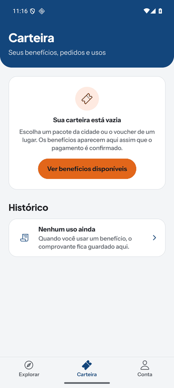

# Experimente+ — aplicativo móvel

Cliente Android e iOS do **Experimente+**, plataforma regional de descoberta e benefícios do norte do
Paraná. Qualquer pessoa explora lugares, agenda e novidades de cada cidade sem criar conta; quem
entra guarda favoritos e roteiros, compra pacotes e vouchers e apresenta os benefícios da carteira;
o parceiro valida esses benefícios pela câmera. Restaurantes, bares e cafés são a primeira vertical,
mas o domínio também comporta lazer, cultura, bem-estar e serviços.

O aplicativo é um cliente fino: regras de negócio, elegibilidade, horários, limites e autorização
ficam na API, no repositório [`experimente-plus`](https://github.com/gabrielmaialva33/experimente-plus),
que também guarda o contrato OpenAPI. O guia de trabalho deste repositório, com os contratos que o
código precisa respeitar, está em [`AGENTS.md`](AGENTS.md).

<p align="center">
  
  
  
  
</p>

<p align="center"><sub>Emulador Android, homologação, dados fictícios de demonstração.</sub></p>

## O que o app faz

| Quem       | Abas                                  | O que encontra                                                                                                                                                                              |
| ---------- | ------------------------------------- | ------------------------------------------------------------------------------------------------------------------------------------------------------------------------------------------- |
| Visitante  | Explorar · Entrar                     | Lista e mapa com um só estado de filtros, busca, cidade, página do lugar (contatos, horários, avaliações, "Para viver aqui"), agenda, novidades e o Concierge de descoberta.                |
| Consumidor | Explorar · Carteira · Conta           | Tudo acima, mais carteira de benefícios, compra de pacotes e vouchers por Pix, apresentação do benefício por QR, histórico de usos, favoritos, seguidos, roteiros, interesses e avaliações. |
| Parceiro   | Explorar · Carteira · Validar · Conta | Leitura do QR do cliente, prévia sem resgate, confirmação explícita e histórico de utilizações. A aba só aparece quando a API concede a capability.                                         |

A composição das abas vem de `GET /api/v1/me/context`; o app nunca decide sozinho que alguém é
parceiro. Em homologação o provedor de pagamento é simulado: o pedido diz que nada é cobrado e a
equipe confirma.

## Stack

| Camada          | Escolha                                                                                                |
| --------------- | ------------------------------------------------------------------------------------------------------ |
| Base            | Expo SDK 57, React Native 0.86 (nova arquitetura), React 19 com React Compiler                         |
| Navegação       | Expo Router (rotas por arquivo em `src/app/`, rotas tipadas)                                           |
| Dados           | TanStack Query sobre um cliente HTTP próprio (`src/api/client.ts`), tipos gerados do OpenAPI           |
| Sessão          | Tokens em SecureStore (Keychain/Keystore); preferências locais em MMKV                                 |
| Mapa            | MapLibre (padrão, sem credencial) ou Google Maps via `expo-maps` quando há chave                       |
| Interface       | Tokens próprios em `src/theme/tokens.ts`, derivados do CSS do web; Instrument Sans e Plus Jakarta Sans |
| Qualidade       | TypeScript estrito, ESLint (`eslint-config-expo`) com Prettier, Jest com `jest-expo`                   |
| Build e entrega | `expo prebuild` + Gradle localmente e na CI; EAS configurado para as lojas                             |

## Requisitos

As versões ficam em [`mise.toml`](mise.toml) e não devem vir do sistema: o Node 26 e o JDK 25 de
uma máquina atual quebram este stack (Metro/Expo 57 ainda não suportam Node 26, e o Gradle do
React Native espera JDK 21).

- [mise](https://mise.jdx.dev/), que instala **Node 24**, **pnpm 11** e **Java Temurin 21**.
- **Android SDK** em `~/.local/share/android-sdk`, com `platform-tools`, `emulator`,
  `cmdline-tools` e uma imagem de sistema. O `mise.toml` exporta `ANDROID_HOME` e põe as
  ferramentas no `PATH`.
- Um emulador (AVD) ou um aparelho Android com depuração USB.
- iOS exige macOS com Xcode; o fluxo iOS ainda não foi validado neste projeto.

Sem o shell integrado ao mise, prefixe os comandos com `mise exec --`.

## Primeiros passos

```bash
mise install                                  # Node, pnpm e Java do projeto
mise exec -- pnpm install --frozen-lockfile   # dependências do lockfile
```

Crie um `.env` na raiz (ele é ignorado pelo Git) com os valores de homologação:

```dotenv
EXPO_PUBLIC_API_BASE_URL=https://experimente-plus.mahina.fun
EXPO_PUBLIC_MAP_STYLE_URL=https://midia-experimente.mahina.fun/maps/norte-parana/style.json
```

Depois gere o projeto nativo e rode o development build, como descrito em
[Rodar no emulador ou no aparelho](#rodar-no-emulador-ou-no-aparelho).

## Variáveis de ambiente

Toda variável `EXPO_PUBLIC_*` é **pública**: o Expo a copia em texto claro para dentro do bundle.
Nunca coloque segredo, token ou credencial nelas. As URLs de homologação abaixo são públicas.

| Variável                          | Uso                                                                                                                                                           | Sem ela                                                                    |
| --------------------------------- | ------------------------------------------------------------------------------------------------------------------------------------------------------------- | -------------------------------------------------------------------------- |
| `EXPO_PUBLIC_API_BASE_URL`        | Origem da API. O **hostname escolhe a operação** (tenant); o app não envia `tenant_id` em rotas públicas. Homologação: `https://experimente-plus.mahina.fun`. | Usa a homologação.                                                         |
| `EXPO_PUBLIC_MAP_STYLE_URL`       | Estilo MapLibre. Homologação: o basemap regional Protomaps, `https://midia-experimente.mahina.fun/maps/norte-parana/style.json`.                              | Usa `demotiles.maplibre.org`, que termina no zoom 6: o mapa abre sem ruas. |
| `EXPO_PUBLIC_GOOGLE_MAPS_API_KEY` | Opcional. Quando existe, o mapa passa a ser desenhado pelo Google Maps (`expo-maps`).                                                                         | MapLibre, que não exige credencial.                                        |

- O Expo lê o `.env` ao iniciar o Metro e ao compilar. Mudou um valor? Reinicie o Metro com
  `--clear`.
- O EAS não envia o `.env`, e a CI o ignora de propósito (`EXPO_NO_DOTENV=1`); os valores de cada
  perfil ficam em `eas.json` e no workflow.
- **Trava de produção:** [`app.config.ts`](app.config.ts) recusa um build com
  `EAS_BUILD_PROFILE=production` sem `EXPO_PUBLIC_API_BASE_URL`, apontado para a homologação ou sem
  https, e sem `EXPO_PUBLIC_MAP_STYLE_URL` ou com o estilo de demonstração.

## Rodar no emulador ou no aparelho

O app usa módulos nativos (câmera, mapas, SecureStore, MMKV) e `expo-dev-client`, então **não roda
no Expo Go**: ele precisa de um development build instalado.

```bash
# 1. Gera android/ a partir de app.json e dos config plugins
mise exec -- npx expo prebuild -p android --no-install

# 2. Compila, instala o dev client e inicia o Metro (8081 por padrão)
mise exec -- pnpm android
```

Com mais de um aparelho conectado, escolha o destino: `pnpm android --device <nome-do-AVD>`.
Se a porta 8081 estiver ocupada, acrescente `--port 8082` e encaminhe a mesma porta
(`adb -s <serial> reverse tcp:8082 tcp:8082`). Depois da primeira instalação, `pnpm start` basta: o
dev client instalado se conecta ao Metro.

> **`android/` não se atualiza sozinho.** `expo run:android` só executa o prebuild quando a pasta
> não existe. Depois de mudar `app.json`, `app.config.ts`, um plugin, uma permissão, o ícone ou a
> splash, rode o prebuild de novo (com `--clean` para regenerar do zero) antes de compilar. As
> pastas `android/` e `ios/` são geradas e ignoradas pelo Git: qualquer ajuste nativo permanente
> entra em `app.json` ou num config plugin, nunca direto nelas.

Links do app usam o esquema `experimenteplus://` e servem para abrir telas direto no dev client:

```bash
adb -s <serial> shell am start -a android.intent.action.VIEW \
  -d "experimenteplus://estabelecimento/londrina/atelier-do-cafe-demo"
```

## Comandos

| Comando                          | O que faz                                                                       |
| -------------------------------- | ------------------------------------------------------------------------------- |
| `pnpm install --frozen-lockfile` | Instala exatamente o lockfile                                                   |
| `pnpm start`                     | Inicia o Metro para o dev client                                                |
| `pnpm android`                   | `expo run:android`: compila, instala e abre o dev client Android                |
| `pnpm ios`                       | `expo run:ios`: exige macOS com Xcode                                           |
| `pnpm web`                       | Alvo web do Expo; não comprova as jornadas nativas                              |
| `pnpm typecheck`                 | TypeScript sem emissão                                                          |
| `pnpm lint`                      | `expo lint` com a regra do Prettier (a formatação faz parte do lint)            |
| `pnpm format`                    | Formata tudo com Prettier; `pnpm format:check` só confere                       |
| `pnpm test --runInBand`          | Jest em série, como na CI; `pnpm test --runInBand src/purchases` roda uma pasta |
| `pnpm api:types`                 | Regenera `src/api/schema.d.ts` a partir do OpenAPI do backend                   |

`pnpm reset-project` é um resto do template do Expo: ele **move ou apaga `src/` e `scripts/`**.
Não use como limpeza.

## Testes, lint e formatação

Os testes ficam em `__tests__/` ao lado de cada domínio (`*.test.ts`/`*.test.tsx`) e usam o preset
`jest-expo` com React Native Testing Library. `jest.setup.js` aplica o mock oficial de
`react-native-safe-area-context`; `jest.resolver.js` deixa o Reanimated rodar com sua implementação
JavaScript. Serviços nativos (SecureStore, MMKV, câmera, mapas) são simulados nos próprios testes.

Antes de um commit, o mesmo que a CI roda:

```bash
mise exec -- pnpm format
mise exec -- pnpm lint
mise exec -- pnpm typecheck
mise exec -- pnpm test --runInBand
```

O Prettier usa os valores do backend (sem ponto e vírgula, aspas simples, 100 colunas). Uma
reformatação mecânica entra em [`.git-blame-ignore-revs`](.git-blame-ignore-revs). Jest passando
não prova câmera, mapas ou iOS: mudanças de navegação ou em módulos nativos pedem conferência no
development build.

## Tipos da API

O backend é a fonte do contrato. `src/api/schema.d.ts` é gerado de
`../experimente-plus/docs/openapi.yaml` e fica versionado, para o app compilar sem o backend ao
lado.

```bash
mise exec -- pnpm api:types   # lê o checkout irmão; não precisa de servidor rodando
git diff src/api/schema.d.ts  # revise e adapte os consumidores
```

O script espera o repositório do backend clonado em `../experimente-plus`. Nunca edite o arquivo
gerado à mão.

## Estrutura

```text
src/
  app/            rotas do Expo Router: (tabs)/ com as abas, telas empilhadas, _layout.tsx, +not-found.tsx
  api/            cliente HTTP, sessão e rotação de tokens, endpoints, QueryClient, schema gerado
  session/        provider de sessão, estados e composição por capabilities
  catalog/        cidades, busca, filtros, horários, contatos e agenda
  explorer/       favoritos, seguidos, roteiros, interesses e "Para você"
  place/          página do lugar: cabeçalho, ações, benefício à venda, informações práticas
  partner-content/  experiências, eventos e vitrine publicados pelo parceiro
  purchases/      produtos, compra, pedidos e intenção de compra persistida
  wallet/         carteira, apresentação do benefício, comprovantes e histórico
  reviews/        avaliações, fotos e denúncias
  concierge/      assistente de descoberta ancorado no catálogo
  maps/           renderizadores MapLibre e Google, pins e atribuição
  media/          validação de imagens enviadas
  analytics/      eventos de descoberta
  components/     componentes compartilhados da direção visual A
  theme/          tokens, fontes, escala de texto, barras do sistema
assets/           ícones, splash e ícone iOS (monograma provisório "E+")
docs/             publicação nas lojas e capturas deste README
scripts/ci/       verificação do APK gerado na CI
.github/workflows/  pipeline "Mobile CI"
```

Imports usam `@/` para `src/` e `@/assets/` para `assets/`.

## Permissões

O app pede só o que usa, e a CI impede que uma dependência acrescente outra coisa em silêncio.

| Plataforma | Pedido                                                  | Para quê                                              |
| ---------- | ------------------------------------------------------- | ----------------------------------------------------- |
| Android    | `CAMERA`                                                | Ler o QR do benefício em Validar (parceiro)           |
| Android    | `INTERNET`, `ACCESS_NETWORK_STATE`, `ACCESS_WIFI_STATE` | Falar com a API e saber quando a conexão cai ou volta |
| iOS        | Câmera (`NSCameraUsageDescription`)                     | Ler o QR do benefício                                 |
| iOS        | Fotos (`NSPhotoLibraryUsageDescription`)                | Escolher as fotos de uma avaliação                    |

- Fotos no Android vêm do seletor do sistema, sem permissão de armazenamento ou mídia.
- `android.blockedPermissions` em [`app.json`](app.json) remove o que as bibliotecas declaram por
  padrão: localização, microfone, armazenamento e mídia, sobreposição de tela, biometria,
  **vibração** (o app não usa haptics) e o ID de publicidade. O Face ID do SecureStore e o
  microfone dos plugins de câmera também estão desligados.
- [`scripts/ci/verify-apk.py`](scripts/ci/verify-apk.py) lê o manifesto do APK gerado na CI e
  falha se aparecer qualquer permissão fora do conjunto revisado (as quatro acima e a permissão
  interna `br.com.experimentemais.DYNAMIC_RECEIVER_NOT_EXPORTED_PERMISSION`), ou se a câmera
  sumir. Uma permissão nova só entra com justificativa, no `app.json` e na lista do script.

## Integração contínua

O workflow [`Mobile CI`](.github/workflows/ci.yml) tem dois jobs:

- **Types and tests** — em todo push, pull request e disparo manual: instala com
  `--frozen-lockfile`, roda `pnpm lint`, `pnpm typecheck` e `pnpm test --runInBand`.
- **Standalone APK (debug key)** — depois do anterior, só em push para a branch padrão ou em disparo
  manual: gera `android/` com `expo prebuild`, compila o release (`arm64-v8a` e `x86_64`) com o
  bundle JavaScript embutido, a origem de homologação e o mapa regional, e assina com a chave de
  debug gerada pelo prebuild. `verify-apk.py` confere bundle, origem, estilo do mapa, ABIs,
  `debuggable=false`, permissões e assinatura.

O APK sai como artefato da execução, na página do run em **Actions**, com o nome
`experimente-plus-pilot-debug-key-<commit>-<data UTC>-<tentativa>` e um `.sha256` ao lado; fica
disponível por 14 dias. Por ser assinado com a chave de debug, ele serve para o piloto e para
testes, não para as lojas.

## Publicação nas lojas

O app ainda não foi publicado. O que não depende do contratante já está pronto: perfis
`development`, `preview` e `production` em [`eas.json`](eas.json), numeração remota de versões,
a trava de produção do `app.config.ts`, permissões mínimas e exclusão de conta dentro do app. As
contas (Expo, Apple Developer, Google Play), o domínio de produção, a identidade visual definitiva
e os textos das lojas vêm do contratante. O passo a passo e as pendências estão em
[`docs/store-submission.md`](docs/store-submission.md).

### Decisões pendentes de confirmação

- **Identificador do aplicativo** — `br.com.experimentemais`, escolhido por convenção (domínio
  comercial ao contrário). Trocá-lo depois de qualquer distribuição cria outro aplicativo nas lojas
  e quebra App Links já verificados; confirme antes do primeiro build de release.
- **Ícone e splash** — o monograma "E+" em `assets/` é provisório.
- **Licença** — o arquivo `LICENSE` ainda é o MIT do template do Expo (copyright da 650 Industries)
  e não descreve este projeto.

## Mapa

O app carrega dois renderizadores e escolhe pela configuração: Google Maps (`expo-maps`) quando
`EXPO_PUBLIC_GOOGLE_MAPS_API_KEY` existe, MapLibre (`@maplibre/maplibre-react-native`) caso
contrário. O MapLibre lê fontes `pmtiles://` diretamente; não adicione a biblioteca JavaScript
`pmtiles`.

Manter dois renderizadores custa tamanho de binário e uma segunda implementação. É uma escolha
deliberada e revisitável: consolidar em um só, provavelmente MapLibre, elimina de vez a dependência
de credencial. A validação visual em aparelhos reais ainda **não foi feita**: zoom 11 a 15 nas três
cidades, acentos nos rótulos e a atribuição Protomaps/OpenStreetMap visível.

## Solução de problemas

| Sintoma                                                         | Causa e saída                                                                                                                                                      |
| --------------------------------------------------------------- | ------------------------------------------------------------------------------------------------------------------------------------------------------------------ |
| Mudei `app.json` (permissão, plugin, ícone) e nada mudou no app | `android/` não foi regenerado. Rode `npx expo prebuild -p android` (ou `--clean`) e compile de novo.                                                               |
| Erro de Gradle ou do Metro logo no início                       | Node ou Java do sistema em vez dos do projeto. Rode com `mise exec --` e confira `node -v` (24) e `java -version` (21).                                            |
| O dev client não encontra o Metro                               | Encaminhe a porta (`adb -s <serial> reverse tcp:8081 tcp:8081`, ou a porta escolhida) e reabra o app; confira se o Metro está de pé.                               |
| A compilação foi para o aparelho errado                         | Com emulador e aparelho conectados, passe `--device <nome>` ao `pnpm android` e `-s <serial>` ao `adb`.                                                            |
| O mapa abre sem ruas                                            | Falta `EXPO_PUBLIC_MAP_STYLE_URL`; sem ela o app usa os tiles de demonstração, que param no zoom 6. Reinicie o Metro com `--clear` depois de ajustar o `.env`.     |
| Build de produção recusado com "Production build refused"       | A trava do `app.config.ts`: configure a URL da API de produção (https) e o estilo de mapa de produção no ambiente do EAS.                                          |
| API local não responde ou mostra outra operação                 | No emulador o host é `http://10.0.2.2:<porta>`; no aparelho, o IP da máquina na rede. Como o hostname escolhe a operação, um IP cai na operação padrão do backend. |
| Teste falha com "Failed to get NitroModules"                    | O teste importou `@/api/client` ou a sessão sem simular o MMKV. Simule `@/api/client` (ou `react-native-mmkv`) no próprio teste.                                   |
| O emulador fecha sozinho                                        | Falta memória: ele precisa de alguns GB livres. Feche outros programas ou limite a RAM do AVD (`-memory 3072`).                                                    |
